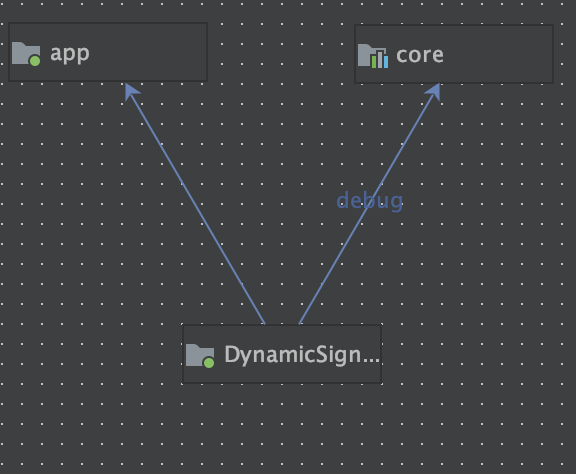

# Cope Android

This is an application to watch your Copes. A Cope is a content that you select from a web page and you save using the chrome extension with the same name. 

## Libraries 
Most used libraries on this project are: 

- Dagger 2 
- Coroutines
- Retrofit
- Airbnb Deeplinkdispatch-processor
- Firebase remote config
- Firebase Performance
- Firebase Crashlytics 
- Mockk 
- Kluent 

## Architecture

This application has a layered architecture respecting and following the guidelines and rules defined by Clean Architecture from  Robert Martin. 

We have three main layers Presentation, Domain and Data. 

For the implementation details we connect the *Presentation* with the *Domain*  layer using Interactors aka use cases, then the interactors uses repositories that can gather data or information from data sources, available in the *Data* layer.

## Project Structure 

We have feature module based structure, were each feature is an Android Library module; each of them has its own dagger component that depends on a common module that is located on a library module called **Core**, on this **Core** module we provide everything that is common for all the features.

We have also an **App** module to *handle* the navigation between features and provide the application base configuration

### Module dependencies looks like 

-  
- 
- 

We have also a Dynamic Module for the users sign up, in which its configurations for dagger and dependencies are the same as any other feature, but its relationship with **App** module differs from other feature. This because this module depends on the **App** one and not viceversa

-  

Notice that *Feature Modules* do not depend on each other, they do not know that other modules exists. 

## Setup 

1.Just clone this project, import it in Android Studio and press Play. 

2. D ownload the following unpacked chrome [extension](https://drive.google.com/file/d/1Js21eF5VA-n_x_02MsytYGfiBpyDXGn8/view?usp=sharing), and install it on Chrome brower. 

3. Create a new user on the Android App. (Signup is not redirecting to the Cope list activity, for now you have to close the app and opening it again).

4. Click on chrome extension and login with the created user. (After press login thats it, even if you do not see a confirmation message) 

5. Go to a web page select something and send it to Cope using right click, and then *Select and sent to Cope*, option. If it was sent successful you will see an alert dialog with *Sent* message. If you do not see confirmation dialog please log in again on the chrome extension. 

6. Open the Android App, Log In and thats it

 
 
 

## Collaboration

Collaboration

You can create a PR for improve an area of the app, solve issues or create a new feature inside it. 

I have some ideas to implement on it like: 

- Delete a Cope
- Add comments to a Cope Detail
- Be able share a Cope with other users
- Search copes with related topics

Also will be nice if we can redirect the user to Cope List after a successful registration. 

Feel free to create a PR or open an Issue, I write the backend so if you want to improve or implement something that requires backend work, let me know and we can sync.

The app is uploaded into the play store as Alpha and Internal Sharing release, if you want to be part of let me know. Also if you want to get invited to the Firebase project as developer.

If you contribute I will add you to the license of the project, be sure to include yourself for the new files you create

# License 

/*
 * Copyright (C) 2020 Oscar Gallon <oscarg798@gmail.com>
 * This file is part of Cope.
 * Cope is free software: you can redistribute it and/or modify
 * it under the terms of the GNU General Public License as published by
 * the Free Software Foundation, either version 3 of the License, or
 * (at your option) any later version.
 * This program is distributed in the hope that it will be useful,
 * but WITHOUT ANY WARRANTY; without even the implied warranty of
 * MERCHANTABILITY or FITNESS FOR A PARTICULAR PURPOSE.  See the
 * GNU General Public License for more details.
 * You should have received a copy of the GNU General Public License
 * along with this program.  If not, see <http://www.gnu.org/licenses/>.
 */